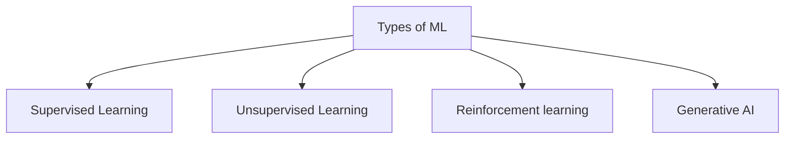

##### [[2.) SuperVised Learning]]
Seeing lots of data with the correct answers and then discovering the connections

Regression       predicts a numeric value.
Classification    whether or not something belongs to a particular category.

#### Unsupervised Learning
Identify meaningful patterns among the data with no correct answers 
![[clustering-03.png|400]]

#### Reinforcement learning
Predictions by getting rewards or penalties based on actions

#### Generative AI
Generative models learn patterns in data with the goal to produce new but similar data
